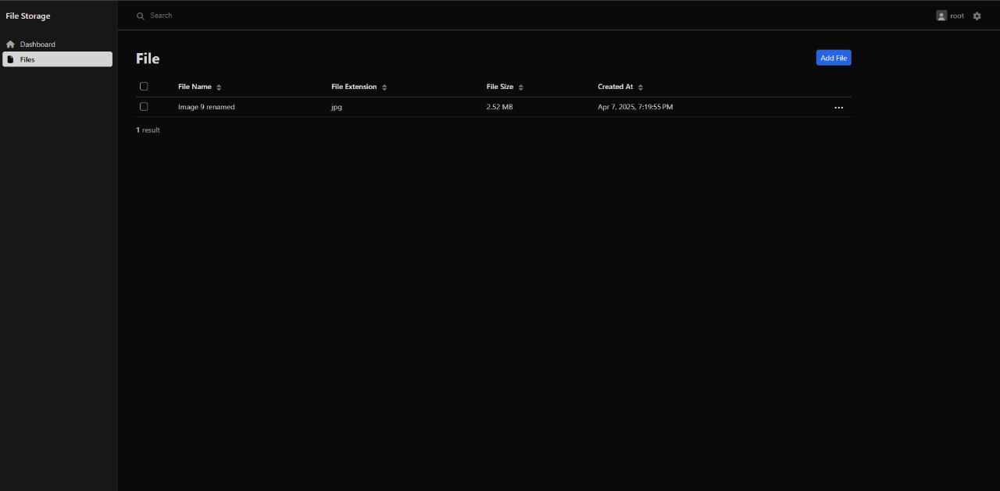
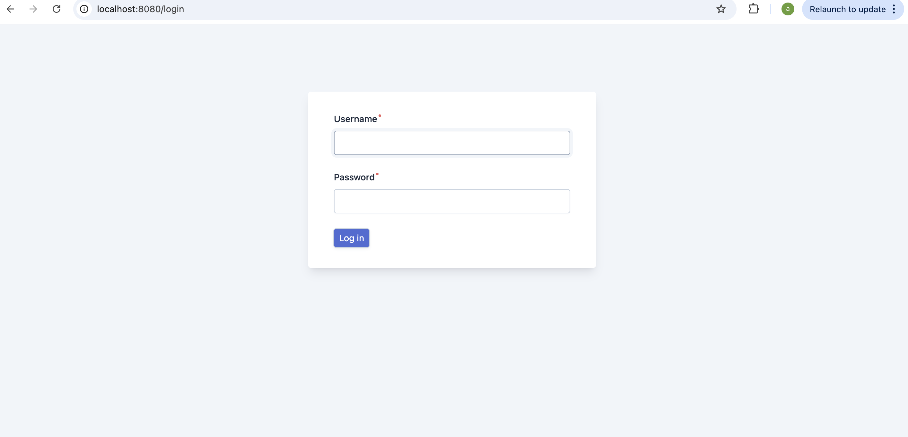

# File Management System

This project is a File Management System built with Symfony. It allows users to upload, manage, and download files securely. Only the owners of the files can access them. The task did not specify the need for user registration implementation, so there is just a simple command provided for user creation listed below.

### Why EasyAdmin bundle?
https://symfony.com/bundles/EasyAdminBundle/current/index.html

This task was very time-limited for me because I’m also working full-time. So I decided to use EasyAdmin to generate the UI and CRUD functionality quickly. I’m able to build all of that in pure Symfony as well, but I felt I wouldn’t have enough time to do it from scratch. 

## Service Layer Logic

Service layer, encapsulates the core business logic for file management. Here's a brief overview:

### FileStorageInterface

The `FileStorageInterface` defines the contract for any file storage system used in the application. It provides essential methods for interacting with files, regardless of where they are stored (e.g., local storage, AWS S3, etc.). 

### LocalFileStorage
Concrete implementation of `FileStorageInterface` with local system storage. 

### FileEntityBuilder

The `FileEntityBuilder` class is responsible for constructing `File` entities. It encapsulates the logic for setting various properties of a `File` entity based on an uploaded file and user information.

## Getting Started
1. Copy .env into .env.local file.
2. Run `docker compose build` 
3. Run `docker compose up`
4. Run composer install with web container
   1. `docker exec -it web bash`
   2. `composer install`
5. From web container: `php bin/console doctrine:migrations:migrate`
6. From web container: `php bin/console user:create user pass`
7. http://localhost:8080/ Now you can login and start uploading files

I've integrated DDEV into the project to simplify the development environment setup. If you'd prefer an easier alternative to docker-compose, you can use DDEV to quickly bootstrap and run the application.
https://ddev.readthedocs.io/en/stable/

## 📸 Screenshots

